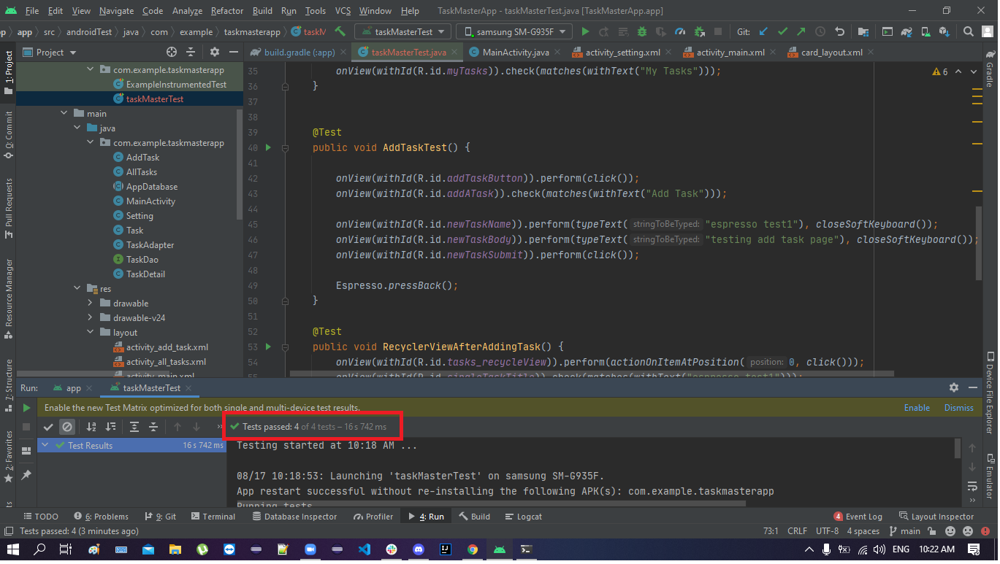

# taskMaster

Lab01
This is the very beginning of taskMaster App with three pages
   

lab02
The app now has 2 new pages
Setting page to let the user enter his name
Task Detail page that has the task title and task description

lab03
The home page is updated with new recyclerview and its displaying hard coded tasks
Task detail page updated and its displaying task name, body and status.

* recyclerview in home page

* task detail page

* delete button

lab04 
The home page recyclerview is updated and its displaying data from Room database
Add task is updated also now we add task to the database 
the delete text inside the card now also delete from database

lab05
I added all the [test](./app/src/androidTest/java/com/example/taskmasterapp/taskMasterTest.java) for all the functionality in the app

lab06
The data is stored in AWS Amplify using DynamoDB 
And the app is getting the data from DynamoDB

lab07
The user can select a team while adding a task to specify in which team this task for
The user also can go setting and select a team to display all tasks that belongs to that team

lab08
Using S3 storage The user can upload a file

lab09
Using AWS The user can receive a notification   

